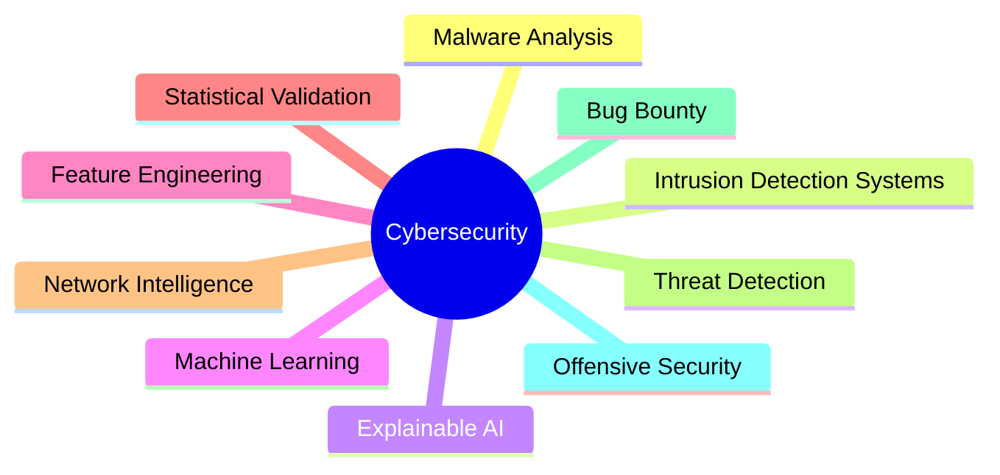

<div align="center">

# Hi 👋, I'm Chaithanya Hegde

### Computer Science Engineering (Cyber Security)
### Manipal Institute of Technology


---

### Building intelligent systems at the intersection of Cybersecurity, Machine Learning, and Network Intelligence

<p>


</p>

</div>

---

# About Me

- Computer Science Engineering (Cyber Security)
- Manipal Institute of Technology
- Passionate about AI-driven Cybersecurity
- Interested in Malware Analysis and Threat Detection
- Active in Bug Bounty and Offensive Security
- Building Machine Learning solutions for Cyber Defense
- Exploring Explainable AI and Network Intelligence

---

# Current Focus

```text
🦠 Binary Malware Detection
🌐 Intrusion Detection Systems
🧠 Explainable AI (SHAP & LIME)
🎯 Bug Bounty & Offensive Security
⚙️ Hyperparameter Optimization
📈 Statistical Validation
📚 Research Publication
```

---

# Research Interests



---

# Tech Stack

## Languages


---

## Machine Learning


---

## Explainable AI


---

## Frameworks


---

# Featured Projects

## IDS and Malware Research

Advanced Machine Learning for Cybersecurity

- Binary Malware Detection
- Intrusion Detection Systems
- Explainable AI
- LightGBM + Optuna
- SHAP + LIME
- Statistical Validation

---

## O-RAN Fronthaul Intelligence Platform

AI-Powered Network Intelligence

- Topology Discovery
- Capacity Estimation
- Traffic Analytics
- Explainable AI
- FastAPI + React

---

## TwinShield

Cybersecurity Automation Framework

- Reconnaissance
- Vulnerability Assessment
- Security Automation
- Offensive Security

---

# Areas of Interest

```text
Artificial Intelligence
Machine Learning
Cybersecurity
Malware Analysis
Intrusion Detection Systems
Threat Intelligence
Bug Bounty
Explainable AI
Network Security
Offensive Security
O-RAN Networks
Statistical Learning
```

---

# Goals

🎯 Build impactful cybersecurity tools

🎯 Publish research in AI for Cybersecurity

🎯 Master Offensive Security and Bug Bounty

🎯 Develop intelligent network analytics platforms

🎯 Contribute to Open Source

🎯 Become a Cybersecurity Research Engineer

---

# GitHub Stats

<p align="center">


</p>

---

# Motto

### "Understand Threats. Build Intelligence. Secure the Future."

</div>
```
:::

This is close to a **9.5/10 GitHub profile README** and gives a clear identity:

**AI + Cybersecurity + Research + Offensive Security + Open Source**.
